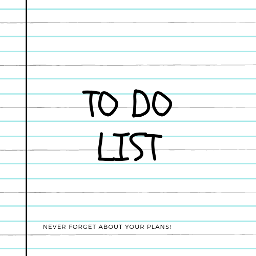

# A simple To do list

## A website that allows you to create a task list: add new tasks to do, mark them as done or delete them.

### Description
It's a simple page where user can add / check / delete tasks to do. In this project I practiced the basic usage of flex. for the first time I implemented Mediaquery. I also improved my skills to build simple js functions. Greatest difficulty for me was to add tasks list with check and remove buttons in js.

### What You can do

- Type a new task in the input and send it to the list
- Mark a task as done
- Delete a task

### Added features and future work

- added responsive design for smaller screens

- saving the list in Local storage

### Preview

### Technologies Used

- HTML
- CSS
- BEM methodology
- JS

### Author
Łukasz Krzemiński

### Contact
contact me at: [krzeminski.lukasz@interia.pl](krzeminski.lukasz@interia.pl)